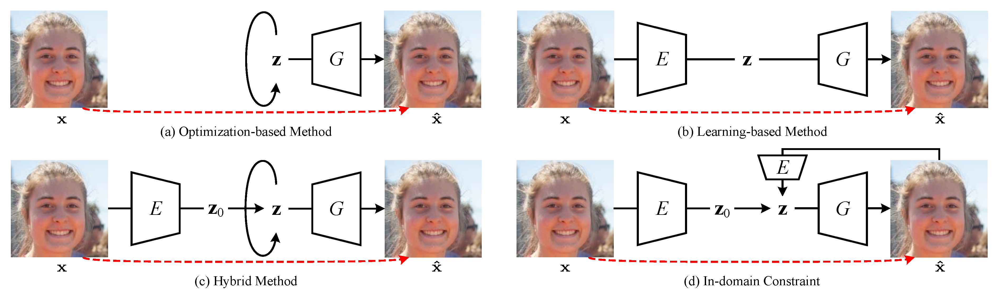

## Abstract

Generative adversarial networks (GANs) have drawn enormous attention due to the simple yet effective training mechanism and superior image generation quality. With the ability to generate photo-realistic high-resolution (*e.g.*, $1024\times1024$) images, recent GAN models have greatly narrowed the gaps between the generated images and the real ones. Therefore, many recent works show emerging interest to take advantage of pre-trained GAN models by exploiting the well-disentangled latent space and the learned GAN priors. We briefly review recent progress on leveraging pre-trained large-scale GAN models from three aspects, *i.e.*, 1) the training of large-scale generative adversarial networks, 2) exploring and understanding the pre-trained GAN models, and 3) leveraging these models for subsequent tasks like image restoration and editing.

## Contents

<details open><summary>Figure 1. Illustration of GAN inversion methods.</summary>
  <details><summary>Illustration</summary>
    
In this figure, $\mathbf{x}$ and $\mathbf{\hat{x}}$ are given real image and generated image, respectively. The red dotted line means supervision. It can be seen that the in-domain constraint requires the generated image $\mathbf{\hat{x}}$ can be inverted back into the latent space. Here, $\mathbf{z}$ is not restricted in $\mathcal{Z}$ space, and may refer to more generic latent code (*e.g.*, $\mathbf{w}$, $\mathbf{f}$, *etc*).
  </details>
  <details open><summary>Figure Content (PDF file <a href="Inversion.pdf">here</a>)</summary>
  
  </details>
</details>

---

<details><summary>Figure 2. A Summary of Relevant Papers</summary>
  If you want to get the raw file, please refer to <a href="https://www.processon.com/view/link/62b173641efad41af0484fee" target="_blank">ProcessOn.com (passcode: 1qaz)</a>
  
</details>

----

<details><summary>Figure 3. Illustration of recent GAN models (see (a)$\sim$(d)) and the latent spaces of StyleGAN series (see (e)).</summary>  
  <details><summary>Illustration</summary>
    (a) For PGGAN, the blue part denotes the progressive growing procedure from $4\times4$ to $8\times8$. The components with dash lines are employed for the fade-in strategy, where $\alpha$ is gradually growing to 1. They are discarded when the model grows to a higher-resolution. (b) For BigGAN, a specific noise is delivered to each layer together with the class embedding, and the model is end-to-end trained without the progressive growing procedure. (c) For StyleGAN, a series of FC layers are deployed to map $\mathbf{z}$ into $\mathbf{w}$. The green only belongs to StyleGAN2. (d) For StyleGAN3, the generator is largely modulated to improve the translational and rotation equivariance. The discriminator is omitted since it is identical with that used in StyleGAN2. (e) For simplicity, here we take the StyleGAN series as an example to show the latent spaces based on GAN inversion task.
  </details>
  <details open><summary>Figure Content (PDF file <a href="GAN_arch.pdf">here</a>)</summary>
  
    </details>
</details>

----

<details><summary>Table 1. A summary of GAN inversion and methods leveraging pre-trained GANs for image editing and restoration.</summary>
  <details><summary>Illustration</summary>
    
For the inversion method, "O", "L", "T" represent optimization-based, learning-based, and training-based (or fine-tuning) methods, while "/" means no inversion is performed in this method, and the numbers (without square brackets) are the indices of methods used for inversion in this table. Note that the methods are ordered (roughly) according to publicly accessible time (*e.g.*, the appear time on <a target="_blank" href="https://arxiv.org">ArXiv</a>, <a target="_blank" href="https://openreview.net">openreview.net</a>, <a target="_blank" href="https://openaccess.thecvf.com">CVF Open Access</a>, *etc*.).
  </details>
  <details open><summary>Abbreviations</summary>

   $^\ast$ Abbreviations: **AD** (<a target="_blank" href="https://groups.csail.mit.edu/vision/datasets/ADE20K/">ADE20K</a>), **AF** (<a target="_blank" href="https://github.com/clovaai/stargan-v2">AFHQ</a>), **CA** (<a target="_blank" href="http://mmlab.ie.cuhk.edu.hk/projects/CelebA.html">CelebA</a>), **CD** (<a target="_blank" href="https://bcsiriuschen.github.io/CARC/">CACD</a>), **CF** (<a target="_blank" href="http://www.cs.toronto.edu/~kriz/cifar.html">CIFAR</a>), **CH** (<a target="_blank" href="https://github.com/tkarras/progressive\_growing\_of\_gans">CelebA-HQ</a>), **CM** (<a target="_blank" href="https://github.com/switchablenorms/CelebAMask-HQ">CelebAMask-HQ</a>), **CO** (<a target="_blank" href="https://cocodataset.org/\#home">MS COCO</a>), **CS** (<a target="_blank" href="https://www.cityscapes-dataset.com/">CityScapes</a>), **CU** (<a target="_blank" href="https://authors.library.caltech.edu/27452/">Caltech-UCSD Birds</a>), **DA** (<a target="_blank" href="https://www.gwern.net/Danbooru">Danbooru</a>, aka Anime Faces), **DF** (<a target="_blank" href="http://mmlab.ie.cuhk.edu.hk/projects/DeepFashion.html">DeepFashion</a>), **FF** (<a target="_blank" href="https://github.com/nvlabs/stylegan">FFHQ</a>), **FL** (<a target="_blank" href="https://www.robots.ox.ac.uk/~vgg/data/flowers/">Flowers</a>), **IN** (<a target="_blank" href="https://image-net.org/">ImageNet</a>), **LF** (<a target="_blank" href="http://vis-www.cs.umass.edu/lfw/">LFW</a>), **LS** (<a target="_blank" href="https://www.yf.io/p/lsun">LSUN</a>), **MF** (<a target="_blank" href="https://github.com/NVlabs/metfaces-dataset">MetFaces</a>), **MN** (<a target="_blank" href="http://yann.lecun.com/exdb/mnist/">MNIST</a>), **OM** (<a target="_blank" href="https://github.com/brendenlake/omniglot">Omniglot</a>), P3 (<a target="_blank" href="http://places2.csail.mit.edu/">Places365</a>), **PL** (<a target="_blank" href="http://places.csail.mit.edu/">Places</a>), **PT** (<a target="_blank" href="https://www.robots.ox.ac.uk/~vgg/data/pets/">Oxford-IIIT Pet</a>, aka Cats and Dogs), **RA** (<a target="_blank" href="https://zenodo.org/record/1188976">RAVDESS</a>), **SC** (<a target="_blank" href="http://ai.stanford.edu/~jkrause/cars/car\_dataset.html">Stanford Cars</a>), **SS** (<a target="_blank" href="http://streetscore.media.mit.edu/static/files/streetscore\_data.zip">Streetscape</a>), **SV** (<a target="_blank" href="http://ufldl.stanford.edu/housenumbers/">SVHN</a>), **TR** (<a target="_blank" href="http://transattr.cs.brown.edu/">Transient</a>), **UT** (<a target="_blank" href="https://vision.cs.utexas.edu/projects/finegrained/utzap50k/">UT Zappos50K</a>)

$^\dagger$ Abbreviations: **AD** (Adversarial Defense), **AE** (Attribute Editing, *i.e.*, w/o reference), **AN** (Anomaly Detection), **AR** (Artifacts Removal), **AT** (Attribute Transfer, *i.e.*, w/ reference), **CO** (Image Crossover), **[U]DA** ([Unsupervised] Domain Adaptation), **DN** (Image Denoising), **FF** (Face Frontalization), **IC** (Image Colorization), **IG** (Image Generation), **IH** (Information Hiding), **Int** (Interpolation), **Inv** (Inversion), **IP** (Inpainting), **PI** (Parsing or Segmentation to Image), **SI** (Sketch to Image), **SR** (Image Super-resolution), **ST** (Style Transfer), **TR** (Transform and Random Jittering).

$^\ddagger$ Some custom datasets collected or regenerated by the authors are omitted since they are not publicly available or can be generated automatically based on current public datasets.
  </details>
  <details open><summary>Table Content</summary>

| No. |                                                                                                                     Method                                                                                                                     |  Publication  |           Backbone           |          Latent Space         | Inversion Method |     Dataset$^\ast$     |       Application$^\dagger$      |
|:---:|:----------------------------------------------------------------------------------------------------------------------------------------------------------------------------------------------------------------------------------------------:|:-------------:|:----------------------------:|:-----------------------------:|:----------------:|:----------------------:|:--------------------------------:|
|  1  |                                         BiGAN (<a href="https://openreview.net/forum?id=BJtNZAFgg" target="_blank">Link</a>) (<a href="https://github.com/jeffdonahue/bigan" target="_blank">Code</a>)                                         |   ICLR 2017   |               /              |         $\mathcal{Z}$         |         T        |         MN, IN         |                Inv               |
|  2  |                                           ALI (<a href="https://ishmaelbelghazi.github.io/ALI/" target="_blank">Link</a>) (<a href="https://github.com/IshmaelBelghazi/ALI" target="_blank">Code</a>)                                          |   ICLR 2017   |               /              |         $\mathcal{Z}$         |         T        |     CF, SV, CA, IN     |             Inv, Int             |
|  3  |                                          Zhu et al. (<a href="http://efrosgans.eecs.berkeley.edu/iGAN/" target="_blank">Link</a>) (<a href="https://github.com/junyanz/iGAN" target="_blank">Code</a>)                                         |   ECCV 2016   |             DCGAN            |         $\mathcal{Z}$         |       L, O       |  SH, LS, PL$^\ddagger$ |           Inv, Int, AE           |
|  4  |                                                 IcGAN (<a href="https://arxiv.org/abs/1611.06355" target="_blank">Link</a>) (<a href="https://github.com/Guim3/IcGAN" target="_blank">Code</a>)                                                | NeurIPSw 2016 |             cGAN             |  $\mathcal{Z}$, $\mathcal{C}$ |         L        |         MN, CA         |            Inv, AT, AE           |
|  5  |                                      Creswell et al. (<a href="https://arxiv.org/abs/1611.05644" target="_blank">Link</a>) (<a href="https://github.com/ToniCreswell/InvertingGAN" target="_blank">Code</a>)                                   |  T-NNLS 2018  |        DCGAN, WGAN-GP        |         $\mathcal{Z}$         |         O        |       OM, UT, CA       |                Inv               |
|  6  |                                     Lipton et al. (<a href="https://arxiv.org/abs/1702.04782" target="_blank">Link</a>) (<a href="https://github.com/SubarnaTripathi/ReverseGAN" target="_blank">Code</a>)                                     |   ICLRw 2017  |             DCGAN            |         $\mathcal{Z}$         |         O        |           CA           |                Inv               |
|  7  |                                               PGD-GAN (<a href="https://arxiv.org/abs/1802.08406" target="_blank">Link</a>) (<a href="https://github.com/shahviraj/pgdgan" target="_blank">Code</a>)                                           |  ICASSP 2018  |             DCGAN            |         $\mathcal{Z}$         |         O        |         MN, CA         |                Inv               |
|  8  |    Ma et al. (<a href="https://proceedings.neurips.cc/paper/2018/hash/e0ae4561193dbf6e4cf7e8f4006948e3-Abstract.html" target="_blank">Link</a>) (<a href="https://github.com/fangchangma/invert-generative-networks" target="_blank">Code</a>) |  NeurIPS 2018 |             DCGAN            |         $\mathcal{Z}$         |         O        |         MN, CA         |              Inv, IP             |
|  9  |                                        Suzuki et al. (<a href="https://arxiv.org/abs/1811.10153" target="_blank">Link</a>) (<a href="https://github.com/quolc/neural-collage" target="_blank">Code</a>)                                        |   ArXiv 2018  |    SNGAN, BigGAN, StyleGAN   |         $\mathcal{F}$         |         3        |     IN, FL, FF, DA     |                CO                |
|  10 |                                       GANDissection (<a href="https://gandissect.csail.mit.edu/" target="_blank">Link</a>) (<a href="https://github.com/CSAILVision/GANDissect" target="_blank">Code</a>)                                      |   ICLR 2019   |             PGGAN            |         $\mathcal{F}$         |         /        |         LS, AD         |              AE, AR              |
|  11 |                                        NPGD (<a href="https://arxiv.org/abs/1902.09698" target="_blank">Link</a>) (<a href="https://github.com/yuqili3/NPGD_linear_inverse_prob" target="_blank">Code</a>)                                     |   ICCV 2019   |         DCGAN, SAGAN         |         $\mathcal{Z}$         |       L, O       |       MN, CA, LS       |            Inv, SR, IP           |
|  12 |                                    Image2StyleGAN (<a href="https://arxiv.org/abs/1904.03189" target="_blank">Link</a>) (<a href="https://github.com/zaidbhat1234/Image2StyleGAN" target="_blank">Code</a>)                                    |   ICCV 2019   |           StyleGAN           |         $\mathcal{W}+$        |         O        |      FF$^\ddagger$     |         Inv, Int, AE, ST         |
|  13 |                              Bau et al. (<a href="http://bzhou.ie.cuhk.edu.hk/publication/iccv19_see_gan.pdf" target="_blank">Link</a>) (<a href="https://github.com/davidbau/ganseeing" target="_blank">Code</a>)                             |   ICLRw 2019  |   PGGAN, WGAN-GP, StyleGAN   |  $\mathcal{Z}$, $\mathcal{W}$ |       L, O       |           LS           |                Inv               |
|  14 |                                               GANPaint (<a href="https://ganpaint.io/" target="_blank">Link</a>) (<a href="http://gandissect.res.ibm.com/ganpaint.html" target="_blank">Demo</a>)                                              |    ToG 2019   |             PGGAN            |    $\mathcal{Z}$, $\Theta$    |      L, O, T     |           LS           |              Inv, AE             |
|  15 |                                     InterFaceGAN(<a href="https://genforce.github.io/interfacegan/" target="_blank">Link</a>) (<a href="https://github.com/genforce/interfacegan" target="_blank">Code</a>)                                    |   CVPR 2020   |        PGGAN, StyleGAN       |  $\mathcal{Z}$, $\mathcal{W}$ |       3, 8       |           CH           |              AE, AR              |
|  16 |                                            GANSeeing(<a href="http://ganseeing.csail.mit.edu/" target="_blank">Link</a>) (<a href="https://github.com/davidbau/ganseeing" target="_blank">Code</a>)                                            |   ICCV 2019   |   PGGAN, WGAN-GP, StyleGAN   |  $\mathcal{Z}$, $\mathcal{W}$ |        13        |           LS           |                Inv               |
|  17 |                                                YLG(<a href="https://arxiv.org/abs/1911.12287" target="_blank">Link</a>) (<a href="https://github.com/giannisdaras/ylg" target="_blank">Code</a>)                                               |   CVPR 2020   |             SAGAN            |         $\mathcal{Z}$         |         O        |           IN           |                Inv               |
|  18 |                                            Image2StyleGAN++(<a href="https://arxiv.org/abs/1911.11544" target="_blank">Link</a>) (<a href="https://youtu.be/yd5WczbFt68" target="_blank">Video</a>)                                            |   CVPR 2020   |           StyleGAN           | $\mathcal{W}+$, $\mathcal{N}$ |         O        |         LS, FF         |        Inv, CO, IP, AE, ST       |
|  19 |                                         mGANPrior(<a href="https://genforce.github.io/mganprior/" target="_blank">Link</a>) (<a href="https://github.com/genforce/mganprior" target="_blank">Code</a>)                                         |   CVPR 2020   |        PGGAN, StyleGAN       |         $\mathcal{Z}$         |         O        |       FF, CH, LS       |      Inv, IC, SR, IP, DN, AE     |
|  20 |                                                                                  MimicGAN(<a href="https://arxiv.org/abs/1912.07748" target="_blank">Link</a>)                                                                                 |   IJCV 2020   |             DCGAN            |         $\mathcal{Z}$         |         O        |       CA, FF, LF       |         Inv, UDA, AD, AN         |
|  21 |                                                   PULSE(<a href="http://pulse.cs.duke.edu/" target="_blank">Link</a>) (<a href="https://github.com/adamian98/pulse" target="_blank">Code</a>)                                                  |   CVPR 2020   |           StyleGAN           |         $\mathcal{Z}$         |         O        |         FF, CH         |              Inv, SR             |
|  22 |                                        DGP(<a href="https://arxiv.org/abs/2003.13659" target="_blank">Link</a>) (<a href="https://github.com/XingangPan/deep-generative-prior" target="_blank">Code</a>)                                       |   ECCV 2020   |            BigGAN            |         $\mathcal{Z}$         |       O, T       |         IN, P3         | Inv, Int, IC, IP, SR, AD, TR, AE |
|  23 |                             StyleGAN2Distillation(<a href="https://arxiv.org/abs/2003.03581" target="_blank">Link</a>) (<a href="https://github.com/EvgenyKashin/stylegan2-distillation" target="_blank">Code</a>)                             |   ECCV 2020   |     StyleGAN2, pix2pixHD     |         $\mathcal{W}+$        |         /        |           FF           |              AT, AE              |
|  24 |                                        EditingInStyle(<a href="https://arxiv.org/abs/2004.14367" target="_blank">Link</a>) (<a href="https://github.com/IVRL/GANLocalEditing" target="_blank">Code</a>)                                        |   CVPR 2020   |  PGGAN, StyleGAN, StyleGAN2  |         $\mathcal{F}$         |         /        |         FF, LS         |                AT                |
|  25 |                                         StyleRig(<a href="https://vcai.mpi-inf.mpg.de/projects/StyleRig/" target="_blank">Link</a>) (<a href="https://youtu.be/eaW_P85wQ9k" target="_blank">Video</a>)                                         |   CVPR 2020   |           StyleGAN           |         $\mathcal{W}+$        |         /        |           FF           |                AT                |
|  26 |                                                ALAE(<a href="https://arxiv.org/abs/2004.04467" target="_blank">Link</a>) (<a href="https://github.com/podgorskiy/ALAE" target="_blank">Code</a>)                                               |   CVPR 2020   |           StyleGAN           |         $\mathcal{W}$         |         T        |     MN, FF, LS, CH     |              Inv, AT             |
|  27 |                                           IDInvert(<a href="https://genforce.github.io/idinvert/" target="_blank">Link</a>) (<a href="https://github.com/genforce/idinvert" target="_blank">Code</a>)                                          |   ECCV 2020   |           StyleGAN           |         $\mathcal{W}+$        |       L, O       |         FF, LS         |         Inv, Int, AE, CO         |
|  28 |                                       pix2latent(<a href="https://minyoungg.github.io/pix2latent/" target="_blank">Link</a>) (<a href="https://github.com/minyoungg/pix2latent" target="_blank">Code</a>)                                      |   ECCV 2020   |       BigGAN, StyleGAN2      |         $\mathcal{Z}$         |         O        |     IN, CO, CF, LS     |            Inv, TR, AE           |
|  29 |                          IDDistanglement(<a href="https://yotamnitzan.github.io/ID-disentanglement/" target="_blank">Link</a>) (<a href="https://github.com/YotamNitzan/ID-disentanglement" target="_blank">Code</a>)                          |    ToG 2020   |           StyleGAN           |         $\mathcal{W}$         |         L        |           FF           |              Inv, AT             |
|  30 |                                                                                 WhenAndHow(<a href="https://arxiv.org/abs/2006.15555" target="_blank">Link</a>)                                                                                |   ArXiv 2020  |              MLP             |         $\mathcal{Z}$         |         O        |           MN           |              Inv, IP             |
|  31 |                                                                                Guan et al.(<a href="https://arxiv.org/abs/2007.01758" target="_blank">Link</a>)                                                                                |   ArXiv 2020  |           StyleGAN           |         $\mathcal{W}+$        |       L, O       |         CH, CD         |         Inv, Int, AT, IC         |
|  32 |                                                 SeFa(<a href="https://genforce.github.io/sefa/" target="_blank">Link</a>) (<a href="https://github.com/genforce/sefa" target="_blank">Code</a>)                                                |   CVPR 2021   |    PGGAN, BigGAN, StyleGAN   |         $\mathcal{Z}$         |      19, 27      | FF, CH, LS, IN, SS, DA |                AE                |
|  33 |                                             GH-Feat(<a href="https://genforce.github.io/ghfeat/" target="_blank">Link</a>) (<a href="https://github.com/genforce/ghfeat" target="_blank">Code</a>)                                             |   CVPR 2021   |           StyleGAN           |         $\mathcal{S}$         |         L        |     MN, FF, LS, IN     |            Inv, AT, AE           |
|  34 |                                    pSp(<a href="https://eladrich.github.io/pixel2style2pixel/" target="_blank">Link</a>) (<a href="https://github.com/eladrich/pixel2style2pixel" target="_blank">Code</a>)                                    |   CVPR 2021   |           StyleGAN2          |         $\mathcal{W}+$        |         L        |     FF, AF, CH, CM     |          Inv, FF, SI, SR         |
|  35 |                                      StyleFlow(<a href="https://rameenabdal.github.io/StyleFlow/" target="_blank">Link</a>) (<a href="https://github.com/RameenAbdal/StyleFlow" target="_blank">Code</a>)                                      |    ToG 2021   |      StyleGAN, StyleGAN2     |         $\mathcal{W}+$        |        12        |         FF, LS         |              AT, AE              |
|  36 |                                               PIE(<a href="https://vcai.mpi-inf.mpg.de/projects/PIE/" target="_blank">Link</a>) (<a href="https://youtu.be/UIvmUtVI77k" target="_blank">Code</a>)                                              |    ToG 2020   |           StyleGAN           |         $\mathcal{W}+$        |         O        |           FF           |              AT, AE              |
|  37 |                               Bartz et al.(<a href="https://arxiv.org/abs/2010.11113" target="_blank">Link</a>) (<a href="https://github.com/Bartzi/one-model-to-reconstruct-them-all" target="_blank">Code</a>)                               |   BMVC 2020   |      StyleGAN, StyleGAN2     | $\mathcal{Z}$, $\mathcal{W}+$ |         L        |         FF, LS         |              Inv, DN             |
|  38 |                                                                             StyleIntervention(<a href="https://arxiv.org/abs/2011.09699" target="_blank">Link</a>)                                                                             |   ArXiv 2020  |           StyleGAN2          |         $\mathcal{S}$         |         O        |           FF           |              Inv, AE             |
|  39 |                                           StyleSpace(<a href="https://arxiv.org/abs/2011.12799" target="_blank">Link</a>) (<a href="https://github.com/betterze/StyleSpace" target="_blank">Code</a>)                                          |   CVPR 2021   |           StyleGAN2          |         $\mathcal{S}$         |         O        |         FF, LS         |              Inv, AE             |
|  40 |                                       Hijack-GAN(<a href="https://a514514772.github.io/hijackgan/" target="_blank">Link</a>) (<a href="https://github.com/a514514772/hijackgan" target="_blank">Code</a>)                                      |   CVPR 2021   |        PGGAN, StyleGAN       |         $\mathcal{Z}$         |         /        |           CH           |                AE                |
|  41 |                                          NaviGAN(<a href="https://arxiv.org/abs/2011.13786" target="_blank">Link</a>) (<a href="https://github.com/yandex-research/navigan" target="_blank">Code</a>)                                          |   CVPR 2021   | pix2pixHD, BigGAN, StyleGAN2 |            $\Theta$           |     StyleGAN2    |     FF, LS, CS, IN     |                AE                |
|  42 |                                       GLEAN(<a href="https://ckkelvinchan.github.io/projects/GLEAN/" target="_blank">Link</a>) (<a href="https://github.com/ckkelvinchan/GLEAN" target="_blank">Code</a>)                                      |   CVPR 2021   |           StyleGAN           |         $\mathcal{W}+$        |         L        |         FF, LS         |              Inv, SR             |
|  43 |                                          ImprovedGANEmbedding(<a href="https://arxiv.org/abs/2012.09036" target="_blank">Link</a>) (<a href="https://github.com/ZPdesu/II2S" target="_blank">Code</a>)                                         |   ArXiv 2020  |      StyleGAN, StyleGAN2     |         $\mathcal{P}$         |         O        |    FF, MF$^\ddagger$   |          Inv, IC, IP, SR         |
|  44 |                                         GFPGAN(<a href="https://xinntao.github.io/projects/gfpgan" target="_blank">Link</a>) (<a href="https://github.com/TencentARC/GFPGAN" target="_blank">Code</a>)                                         |   CVPR 2021   |           StyleGAN2          |         $\mathcal{W}$         |         L        |           FF           |              Inv, SR             |
|  45 |                                           EnjoyEditing(<a href="https://arxiv.org/abs/2102.01187" target="_blank">Link</a>) (<a href="https://github.com/KelestZ/Latent2im" target="_blank">Code</a>)                                          |   ICLR 2021   |       PGGAN, StyleGAN2       |         $\mathcal{Z}$         |        12        |   FF, CA, CH, P3, TR   |              Inv, AE             |
|  46 |                                              SAM(<a href="https://yuval-alaluf.github.io/SAM/" target="_blank">Link</a>) (<a href="https://github.com/yuval-alaluf/SAM" target="_blank">Code</a>)                                              |    ToG 2021   |           StyleGAN           |         $\mathcal{W}+$        |         L        |         CA, CH         |                AE                |
|  47 |                                            e4e(<a href="https://arxiv.org/abs/2102.02766" target="_blank">Link</a>) (<a href="https://github.com/omertov/encoder4editing" target="_blank">Code</a>)                                            |    ToG 2021   |           StyleGAN2          |         $\mathcal{W}+$        |         L        |     FF, CH, LS, SC     |              Inv, AE             |
|  48 |                                          StyleCLIP(<a href="https://arxiv.org/abs/2103.17249" target="_blank">Link</a>) (<a href="https://github.com/orpatashnik/StyleCLIP" target="_blank">Code</a>)                                          |   ICCV 2021   |           StyleGAN2          | $\mathcal{W}+$, $\mathcal{S}$ |       47, O      |     FF, CH, LS, AF     |                AE                |
|  49 |                               LatentComposition(<a href="https://chail.github.io/latent-composition/" target="_blank">Link</a>) (<a href="https://github.com/chail/latent-composition" target="_blank">Code</a>)                               |   ICLR 2021   |       PGGAN, StyleGAN2       |         $\mathcal{Z}$         |         L        |       FF, CH, LS       |            Inv, IP, AT           |
|  50 |                                     GANEnsembling(<a href="https://chail.github.io/gan-ensembling/" target="_blank">Link</a>) (<a href="https://github.com/chail/gan-ensembling" target="_blank">Code</a>)                                     |   CVPR 2021   |           StyleGAN2          |         $\mathcal{W}+$        |       L, O       |       CH, SC, PT       |              Inv, AT             |
|  51 |                                ReStyle(<a href="https://yuval-alaluf.github.io/restyle-encoder/" target="_blank">Link</a>) (<a href="https://github.com/yuval-alaluf/restyle-encoder" target="_blank">Code</a>)                                |   ICCV 2021   |           StyleGAN2          |         $\mathcal{W}+$        |         L        |   FF, CH, SC, LS, AF   |              Inv, AE             |
|  52 |                                           E2Style(<a href="https://wty-ustc.github.io/inversion/" target="_blank">Link</a>) (<a href="https://github.com/wty-ustc/e2style" target="_blank">Code</a>)                                           |   T-IP 2022   |           StyleGAN2          |         $\mathcal{W}+$        |         L        |         FF, CH         |  Inv, SI, PI, AT, IP, SR, AE, IH |
|  53 |                                                  GPEN(<a href="https://arxiv.org/abs/2105.06070" target="_blank">Link</a>) (<a href="https://github.com/yangxy/GPEN" target="_blank">Code</a>)                                                 |   CVPR 2021   |           StyleGAN2          | $\mathcal{W}+$, $\mathcal{N}$ |         L        |         FF, CH         |              Inv, SR             |
|  54 |                               Consecutive(<a href="https://arxiv.org/abs/2107.13812" target="_blank">Link</a>) (<a href="https://github.com/cnnlstm/InvertingGANs_with_ConsecutiveImgs" target="_blank">Code</a>)                              |   ICCV 2021   |           StyleGAN           |         $\mathcal{W}+$        |         O        |         FF, RA         |           Inv, Int, AE           |
|  55 |                            BDInvert(<a href="https://kkang831.github.io/publication/ICCV_2021_BDInvert/" target="_blank">Link</a>) (<a href="https://github.com/kkang831/BDInvert_Release" target="_blank">Code</a>)                           |   ICCV 2021   |      StyleGAN, StyleGAN2     |  $\mathcal{F}$/$\mathcal{W}+$ |         O        |       FF, CH, LS       |              Inv, AE             |
|  56 |                                             HFGI(<a href="https://tengfei-wang.github.io/HFGI/" target="_blank">Link</a>) (<a href="https://github.com/Tengfei-Wang/HFGI" target="_blank">Code</a>)                                            |   CVPR 2022   |           StyleGAN2          | $\mathcal{W}+$, $\mathcal{F}$ |         L        |       FF, CH, SC       |              Inv, AE             |
|  57 |                                       VisualVocab(<a href="https://visualvocab.csail.mit.edu/" target="_blank">Link</a>) (<a href="https://github.com/schwettmann/visual-vocab" target="_blank">Code</a>)                                      |   ICCV 2021   |            BigGAN            |         $\mathcal{Z}$         |         /        |         P3, IN         |                AE                |
|  58 |                                    HyperStyle(<a href="https://yuval-alaluf.github.io/hyperstyle/" target="_blank">Link</a>) (<a href="https://github.com/yuval-alaluf/hyperstyle" target="_blank">Code</a>)                                   |   CVPR 2022   |           StyleGAN2          |         $\mathcal{W}+$        |         L        |       FF, CH, AF       |            Inv, AE, ST           |
|  59 |                                         GANGealing(<a href="https://www.wpeebles.com/gangealing" target="_blank">Link</a>) (<a href="https://github.com/wpeebles/gangealing" target="_blank">Code</a>)                                         |   CVPR 2022   |           StyleGAN2          |         $\mathcal{W}$         |         /        |   LS, FF, AF, CH, CU   |                TR                |
|  60 |                                 HyperInverter(<a href="https://di-mi-ta.github.io/HyperInverter/" target="_blank">Link</a>) (<a href="https://github.com/VinAIResearch/HyperInverter" target="_blank">Code</a>)                                |   CVPR 2022   |           StyleGAN2          |    $\mathcal{W}$, $\Theta$    |         L        |       FF, CH, LS       |           Inv, Int, AE           |
|  61 |                                       InsetGAN(<a href="http://afruehstueck.github.io/insetgan/" target="_blank">Link</a>) (<a href="https://github.com/afruehstueck/insetGAN" target="_blank">Code</a>)                                       |   CVPR 2022   |           StyleGAN2          |         $\mathcal{W}+$        |         O        |    FF, DF$^\ddagger$   |              CO, IG              |
|  62 |                           HairMapper(<a href="http://www.cad.zju.edu.cn/home/jin/cvpr2022/cvpr2022.htm" target="_blank">Link</a>) (<a href="https://github.com/oneThousand1000/HairMapper" target="_blank">Code</a>)                           |   CVPR 2022   |           StyleGAN2          |         $\mathcal{W}+$        |        47        |    FF, CM$^\ddagger$   |                AE                |
|  63 |                                      SAMInv(<a href="https://www.cs.cmu.edu/~SAMInversion/" target="_blank">Link</a>) (<a href="https://github.com/adobe-research/sam_inversion" target="_blank">Code</a>)                                     |   CVPR 2022   |    BigGAN-deep, StyleGAN2    | $\mathcal{W}+$, $\mathcal{F}$ |         L        |       FF, LS, IN       |              Inv, AE             |
</details>
</details>


## Contributions

Pull requests are welcome for error correction and content expansion!

## Citation

Our paper will be released soon, please stay tuned.

```
@article{liu2022pretrainedGANs,
  title={A Survey on Leveraging Pre-trained Generative Adversarial Networks for Image Editing and Restoration},
  author={Liu, Ming and Wei, Yuxiang and Wu, Xiaohe and Zuo, Wangmeng and Zhang, Lei},
  journal={arXiv preprint arXiv:xxxx.xxxxx},
  year={2022}
}
```
